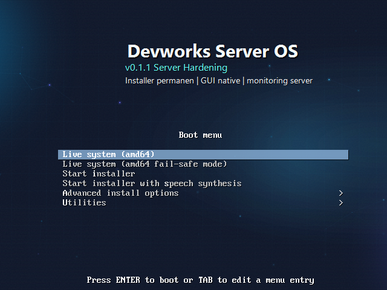
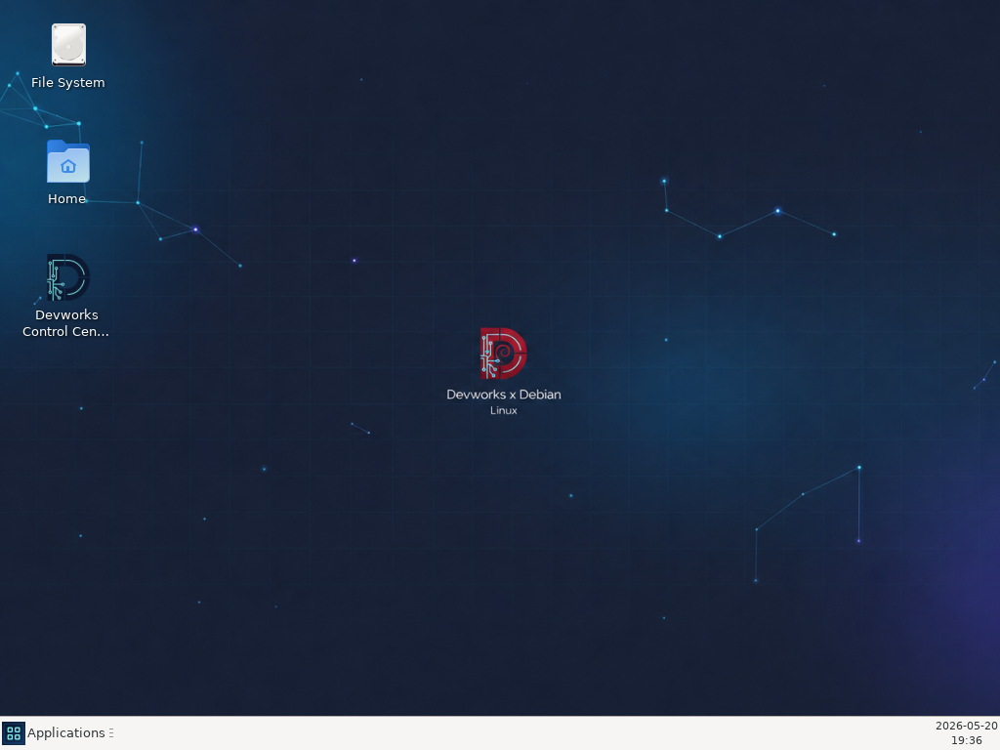

# Devworks Server OS

[](https://github.com/affandy21/devworks-server-os/releases)
[](https://github.com/affandy21/devworks-server-os/actions/workflows/validate.yml)
[](docs/RELEASE_NOTES.md)
[](docs/DEVWORKS_SERVER_OS_MANUAL.md)
[](LICENSE)


Devworks Server OS adalah distribusi Linux kustom berbasis Debian Stable yang dirancang sebagai lingkungan server web, runtime AI lokal, serta monitoring sistem.

Build saat ini telah mencakup ISO bootable, desktop GUI ringan, Devworks Control Center berbasis aplikasi native, serta installer permanen ke disk. Sistem ini cocok digunakan untuk pembelajaran server secara langsung, eksperimen lokal, dan pengembangan dalam lingkungan yang aman dan terkontrol.

## Preview





## Download

Release terbaru tersedia di halaman [GitHub Releases](https://github.com/affandy21/devworks-server-os/releases).

Asset release:

- `devworks-server-os.iso`
- `devworks-server-os-autoinstall.iso`
- `devworks-server-os.iso.sha256`
- `devworks-server-os-autoinstall.iso.sha256`
- `devworks-server-os-package-manifest.tsv`
- `devworks-server-os-release-signing-key.asc`
- `*.asc` detached GPG signatures

## Dokumentasi

Manual utama:

- [Devworks Server OS Manual](docs/DEVWORKS_SERVER_OS_MANUAL.md)

Dokumen pendukung:

- [Specification](docs/SPEC.md)
- [ISO Build Guide](docs/ISO.md)
- [VirtualBox Setup](docs/VIRTUALBOX_SETUP.md)
- [Build Result](docs/BUILD_RESULT.md)
- [ISO Build Status](docs/ISO_BUILD_STATUS.md)
- [Release Notes](docs/RELEASE_NOTES.md)
- [Roadmap](docs/ROADMAP.md)
- [Verify Release](docs/VERIFY_RELEASE.md)
- [Server Hardening](docs/SERVER_HARDENING.md)
- [Server Backup Restore](docs/SERVER_BACKUP_RESTORE.md)
- [Third-Party Notices](docs/THIRD_PARTY_NOTICES.md)
- [Source Code Offer](docs/SOURCE_CODE_OFFER.md)
  
## Status Saat Ini

- Dapat dijalankan sebagai live ISO di VirtualBox.
- Mendukung instalasi permanen ke disk virtual kosong.
- Menyediakan desktop GUI ringan.
- Devworks Control Center berjalan sebagai aplikasi native.
- Monitoring realtime tersedia untuk CPU, memori, disk, jaringan, dan service sistem.
- Installer menggunakan konfirmasi disk manual untuk mengurangi risiko salah memilih disk.
- Installer permanen meminta username/password admin dan dapat memasang SSH key seperti OS server umum.
- Instalasi dual-boot otomatis belum didukung. Mode installer saat ini adalah `erase-disk`.
- Profil `production-server` tersedia untuk hardening server: autologin off, SSH key-first, admin UI local-only, UFW ketat.
  
## File ISO

```text
dist/devworks-server-os.iso
dist/devworks-server-os-autoinstall.iso
```

Checksum build terakhir:

```text
devworks-server-os.iso
SHA256: 7c8a48cac05609b2ca16a9232159854b8a3c3f9ce16352b088ad473dbf284119

devworks-server-os-autoinstall.iso
SHA256: d31a48c842c81ca9f313e4d4a06d0e02081db24554cea915776678175addb921
```

## Struktur Proyek

```text
admin-ui/     Devworks Admin UI/API lama
config/       konfigurasi sistem dan daftar paket
dist/         hasil ISO
docs/         dokumentasi resmi proyek
installer/    skrip installer permanen dan profil instalasi
iso/          konfigurasi live ISO
scripts/      skrip build dan helper
services/     unit systemd Devworks
```

## Package Manifest

Manifest paket ISO final tersedia di release asset:

```text
devworks-server-os-package-manifest.tsv
devworks-server-os-package-manifest.tsv.sha256
```

Setelah OS terpasang, manifest paket baru juga dapat dibuat dengan:

```bash
bash scripts/generate-package-manifest.sh devworks-package-manifest.tsv
```

## Verifikasi ISO

Fingerprint release signing key:

```text
426072F517789C47A914345A4F53E388EE9884EA
```

Import public key dan verifikasi signature:

```bash
gpg --import devworks-server-os-release-signing-key.asc
gpg --verify devworks-server-os.iso.asc devworks-server-os.iso
gpg --verify devworks-server-os-autoinstall.iso.asc devworks-server-os-autoinstall.iso
sha256sum -c devworks-server-os.iso.sha256
sha256sum -c devworks-server-os-autoinstall.iso.sha256
```

## Build ISO

Build dilakukan dari Linux/Debian builder:

```bash
sudo bash scripts/build-iso.sh
```

Hasil build akan masuk ke:

```text
dist/devworks-server-os.iso
```

## Instalasi Aman

Untuk VirtualBox atau PC server kosong, gunakan ISO standar:

```text
dist/devworks-server-os.iso
```

Installer akan menampilkan daftar disk dan meminta konfirmasi manual seperti:

```text
ERASE /dev/sda
```

Jangan gunakan ISO autoinstall di PC/laptop yang memiliki data penting.

## Upstream dan Source Code

Devworks Server OS memakai komponen upstream seperti Debian dan Linux kernel. Atribusi, link upstream, dan panduan mendapatkan source code tersedia di:

```text
docs/THIRD_PARTY_NOTICES.md
docs/SOURCE_CODE_OFFER.md
```

Permintaan source code dan compliance dapat diajukan melalui GitHub Issues:

```text
https://github.com/affandy21/devworks-server-os/issues/new/choose
```
